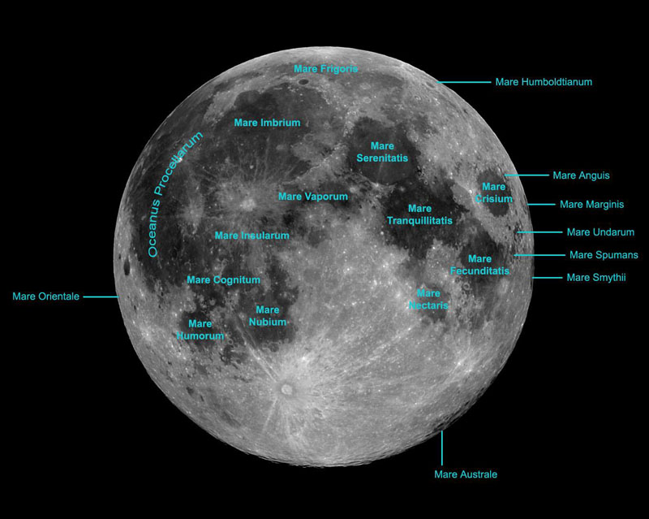
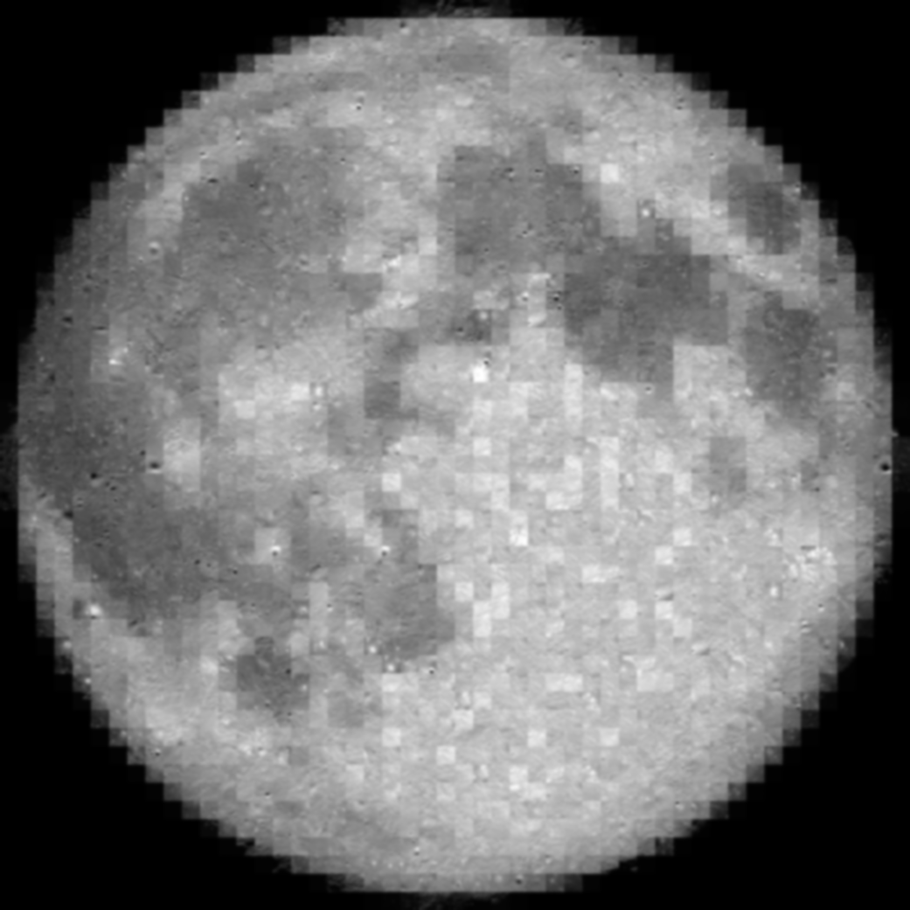
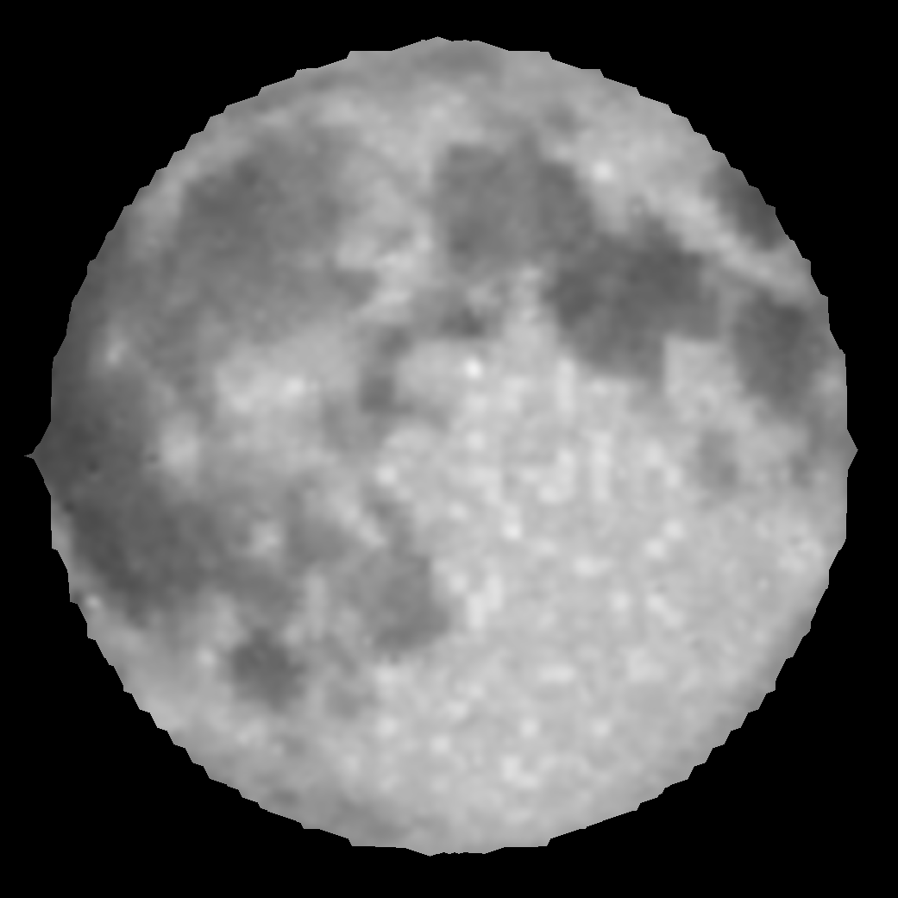
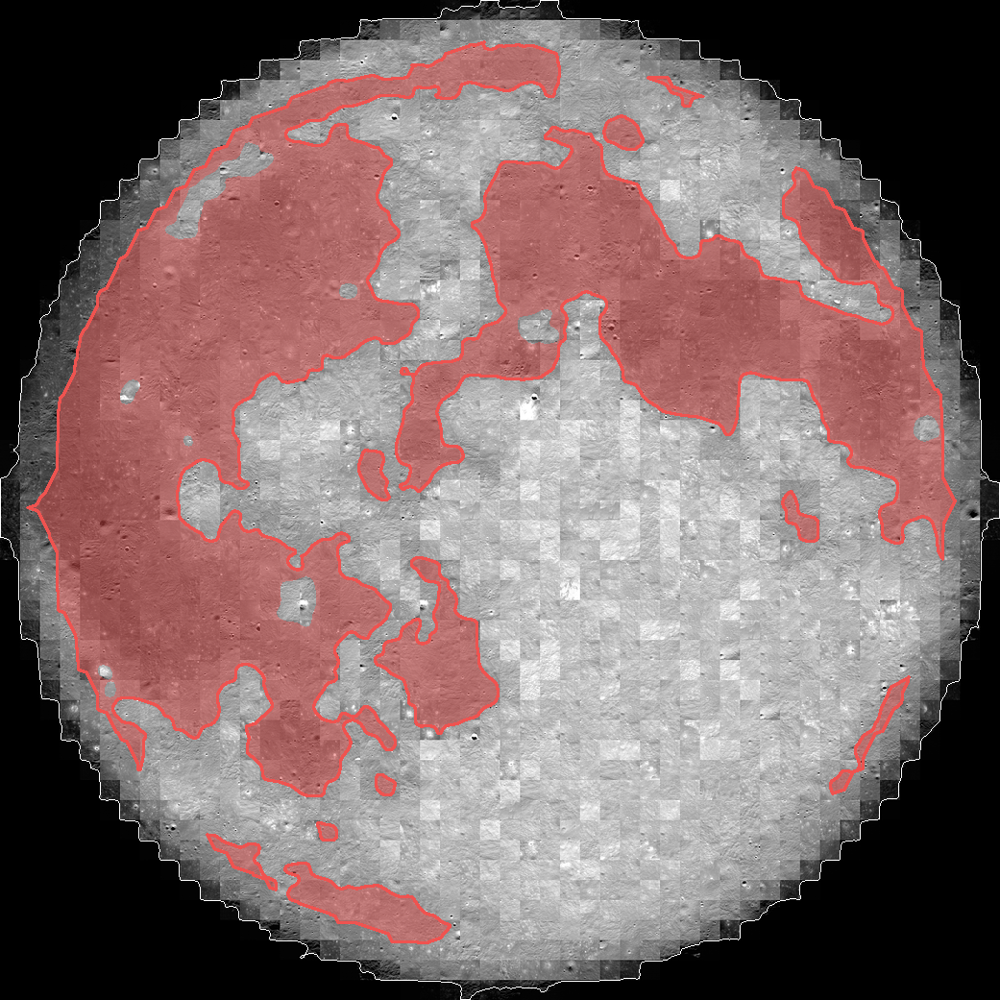
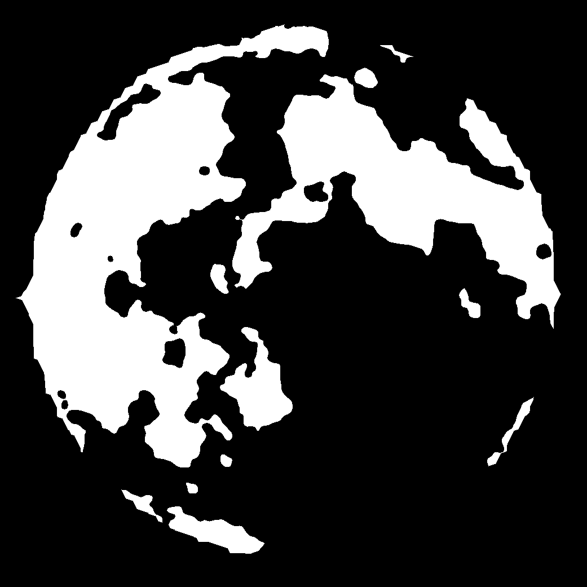
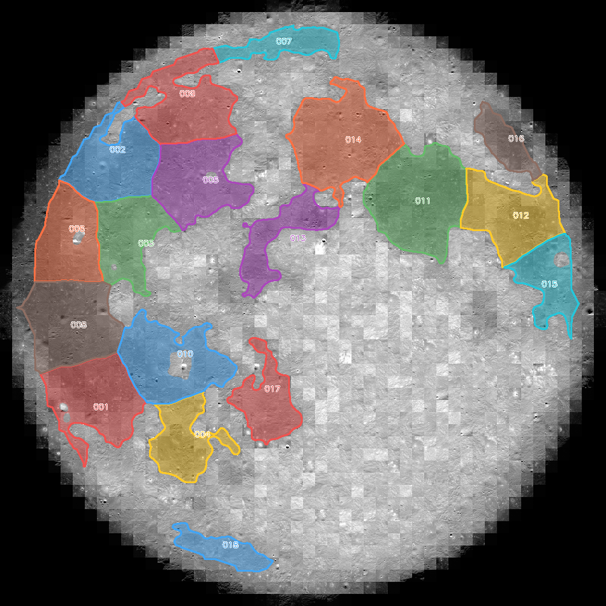

# 🌕 Lunar Faces

This repo is inspired by the work of <a href="https://github.com/fogleman/primitive">fogleman/primitive</a> and also the web app based on this, <a href="https://github.com/Tw1ddle/geometrize">Tw1ddle/geometrize</a>.

  

My idea is simple:

can I reconstruct images, and especially faces, using only lunar maria?

If yes, then I can make <b>lunar faces</b>, which is completely pointless, but also fun and artistic.

Did you never wonder how you would look if you were made out of the Moon?  
Now you can answer it. 🌚

---

## But what are lunar maria?

Lunar maria are the large dark spots you see on the Moon.  
Early astronomers thought they were seas, which is why they are called <i>maria</i>, but actually they are giant basalt plains created by ancient volcanic activity.

In practice, for this project, they are:
- dark
- recognizable
- weirdly beautiful
- and perfect as collage pieces

  

---

## Why use the NASA mosaic image?

For this project I use the <b>NASA lunar mosaic</b> instead of just any random pretty Moon image.

Why?

Because for segmentation, a dramatic Moon photo is not always the best Moon photo.

The NASA mosaic is much better for this because the lighting is more standardized and the brightness is more even across the lunar surface. That makes the maria easier to isolate cleanly and reduces the chance that shadows or contrast tricks get confused with actual maria.

So basically, I want an image that is good for <b>extraction</b>, not just one that looks cool.

### Smoothing the mosaic a little

Before selecting the maria, the mosaic can be smoothed a bit so the big dark regions become easier to isolate.

This step is simple:
- reduce small texture noise
- reduce local contrast weirdness
- keep the large lunar structures
- make the maria read more like coherent dark masses

  
  
  

  
    <b>Left:</b> original NASA mosaic &nbsp; | &nbsp;
    <b>Middle:</b> smoothed version &nbsp; | &nbsp;
    <b>Right:</b> simplified version where the maria become easier to separate
  

This does not need to be scientifically perfect.  
The goal is just to make the lunar maria easier to extract as clean collage pieces.

---

## Project idea

The goal of this project is to reconstruct faces using only pieces cut from lunar maria.

So basically:

- take a face
- understand which parts matter most
- and then try to rebuild it with pieces of the Moon

This is useless, but in a good way.

---

## Main parts of the project

For that, this project is divided into several main parts.

### 1. 🌑 Lunar maria selection into pieces for the collage

The goal is to take a picture of the Moon, more precisely the NASA mosaic where the light is much more standardized, isolate the lunar maria, and use them as the pieces for the collage.

So this step is about:
- isolating the moon
- segmenting the dark maria
- cleaning the mask
- splitting the maria into reusable pieces

These pieces become the visual vocabulary of the whole project.

  
  
  

  
    <b>Left:</b> selected maria regions &nbsp; | &nbsp;
    <b>Middle:</b> clean maria mask &nbsp; | &nbsp;
    <b>Right:</b> extracted corpus pieces
  

### 2. 🙂 Weight faces using MediaPipe Face Mesh

The second step is to transform a face into a weighted grayscale image.

The idea is to give more importance to the facial features that matter most:
- eyes
- eyebrows
- nose
- mouth
- jaw / contour

So instead of treating the whole face equally, the algorithm knows where likeness really lives.

### 3. 🧠 Use the lunar maria to do a collage on the face image

Once we have:
- a corpus of lunar maria pieces
- and a weighted face image

we can start the actual collage.

The collage should use a <b>weighted loss function</b>, so the important facial areas matter more than the less important ones.

The final goal is to generate a recognizable face made only from lunar maria.